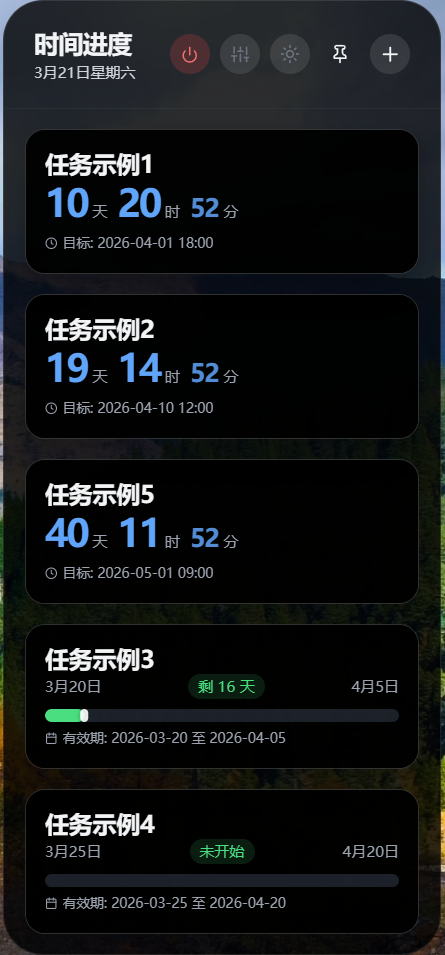
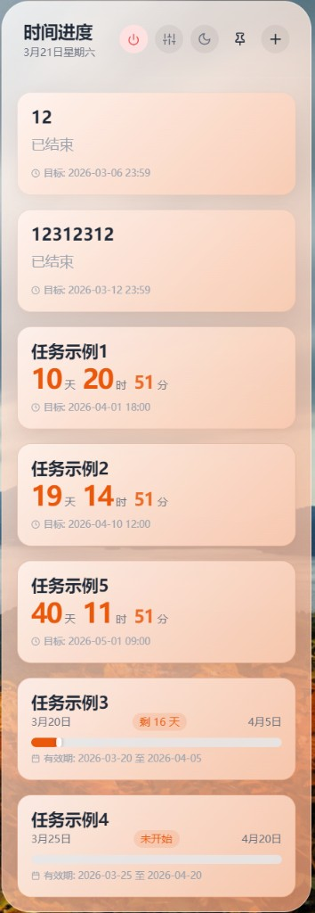

# TaskFlow

轻量级桌面时间进度管理工具，实时追踪任务倒计时与进度。基于 Electron + React 构建。

## 截图预览

<table>
  <tr>
    <td align="center"><b>日间模式</b></td>
    <td align="center"><b>夜间模式</b></td>
    <td align="center"><b>设置页面</b></td>
    <td align="center"><b>更多主题</b></td>
  </tr>
  <tr>
    <td></td>
    <td></td>
    <td></td>
    <td></td>
  </tr>
</table>

## 功能特性

- **任务倒计时** - 实时显示截止日期任务的剩余天数、小时、分钟
- **进度追踪** - 时间段任务的可视化进度条展示
- **主题系统** - 7 种主题配色，支持渐变效果，日间/夜间模式自由切换
- **透明度控制** - 面板背景与任务卡片不透明度独立调节
- **到期提醒** - Windows 系统通知推送，支持自定义提前天数、小时数及重复间隔
- **桌面挂件** - 无边框透明窗口，常驻桌面随时可见
- **位置记忆** - 记住窗口位置，多显示器环境自动校验防止窗口跑到屏幕外
- **开机自启** - 可选随 Windows 登录自动启动
- **离线运行** - 所有依赖已本地化打包，无需联网即可使用

## 安装方式

### 下载安装包

前往 [Releases](https://github.com/Wisdm-K/TaskFlow/releases) 页面，下载最新的 `TaskFlow Setup x.x.x.exe` 安装即可。

### 从源码构建

```bash
git clone https://github.com/Wisdm-K/TaskFlow.git
cd TaskFlow
npm install
npm start       # 开发模式运行
npm run build   # 打包安装程序（输出到 dist/ 目录）
```

## 技术栈

- **Electron** 29 - 桌面应用框架
- **React** 18 - UI 渲染
- **Tailwind CSS** - 原子化样式
- **NSIS** - Windows 安装程序打包

## 项目结构

```
TaskFlow/
├── main.js            # Electron 主进程
├── index.html         # 入口页面
├── App.js             # 根组件
├── Tasks.js           # 任务管理与卡片组件
├── Hooks.js           # 自定义 Hooks（主题、透明度、提醒）
├── Settings.js        # 设置面板与弹窗组件
├── ThemeColors.js     # 主题颜色定义与渐变逻辑
├── Icons.js           # SVG 图标组件
├── Styles.css         # 核心样式与滚动条定制
├── vendor/            # 本地依赖（React、Babel、Tailwind）
├── assets/            # 应用图标
└── package.json       # 项目配置与打包设置
```

## 语言

[English](README.md)

## 许可证

ISC
